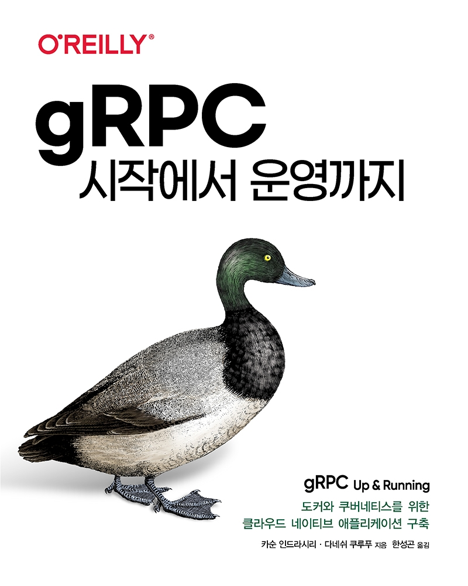

## 소개
본 repository는 "gRPC 시작에서 운영까지" 번역서에 대한 예제와 추가적인 정보를 제공하기 위해 만들어졌습니다.

원서에서 제시된 repository([https://github.com/grpc-up-and-running/samples](https://github.com/grpc-up-and-running/samples))는 도서에서 제공되는 기본 Go 언어 및 일부 Java 예제 외에 다양한 개발 언어에 대하여 예제를 제공하지만, 
도서의 예제 코드와 다르게 작성된 경우가 많습니다. (예제의 완성도를 위해 출간 이후에 수정되었습니다.)

이에 원서 및 번역서 예제 코드 기반으로 온전한 코드와 이를 실행하기 위한 방법 등을 설명하기 위해 본 repository를 제공합니다. (3장부터의 예제는 일부 코드만 제시되어 있어, 전체 코드에 대한 예시도 필요)

아울러, 원서의 예제 코드를 그대로 옮겼으나 일부 수정이 필요한 부분도 같이 제시하였습니다.

## 예제 실행을 위한 사전 준비 사항

* *Go* 언어 설치  
    최신 버전의 Go 언어는 [Go 공식 사이트](https://golang.org/dl/)에서 다운로드 받아 설치합니다. 설치에 대한 설명은 공식 문서([https://golang.org/doc/install](https://golang.org/doc/install))를 참조하세요.
 
* *Java* 설치  
    예제들은 JDK 1.8 기준으로 작성 및 테스트되었으며 [Java 공식 사이트](https://www.java.com/en/download/)에서 다운로드 및 설치합니다.

* *Gradle* 설치  
    Java 예제를 실행하기 위해서는 [Gradle](https://gradle.org/) 설치가 필요합니다.

* *protoc* 설치  
    gRPC는 Protocal buffer 기반으로 [protoc](https://developers.google.com/protocol-buffers/docs/downloads) 설치가 필요합니다.

## 전체 예제 코드
TBD

## 참조 
- 번역서 안내 : http://acornpub.co.kr/book/grpc
- 원서 예제 사이트 : https://github.com/grpc-up-and-running/samples/